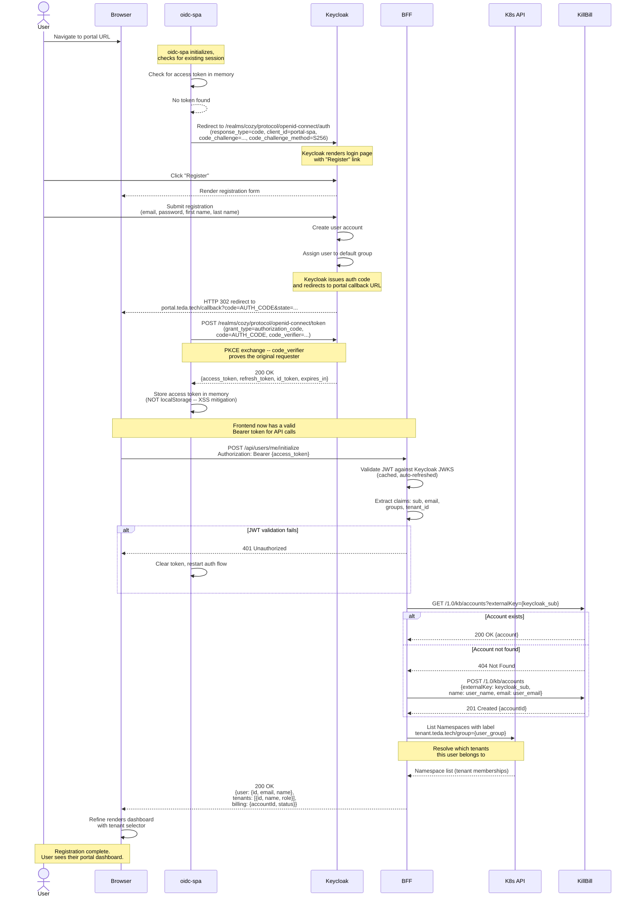
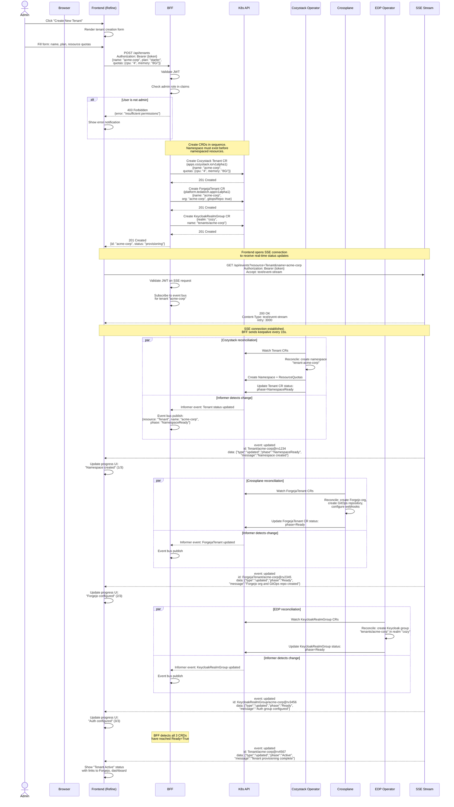
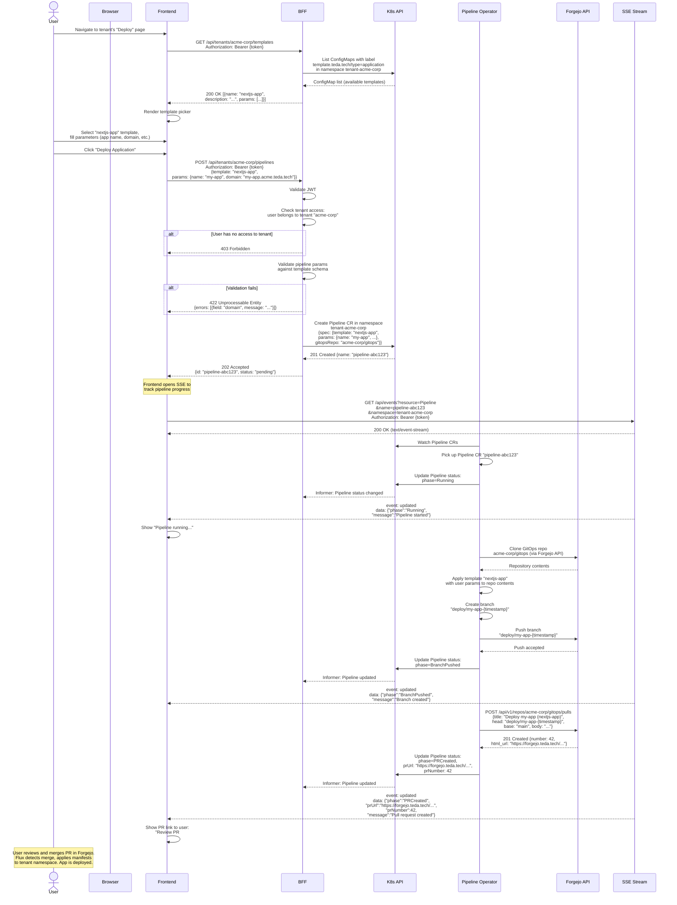
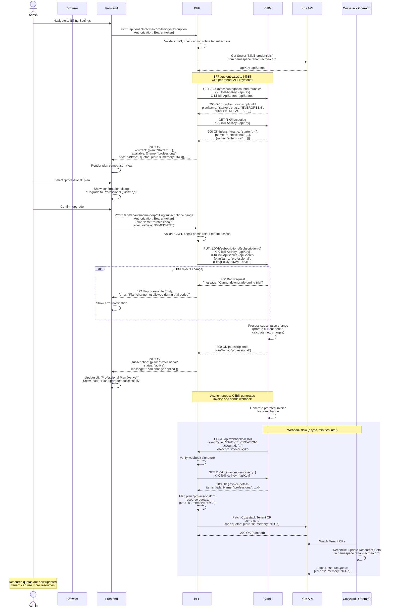
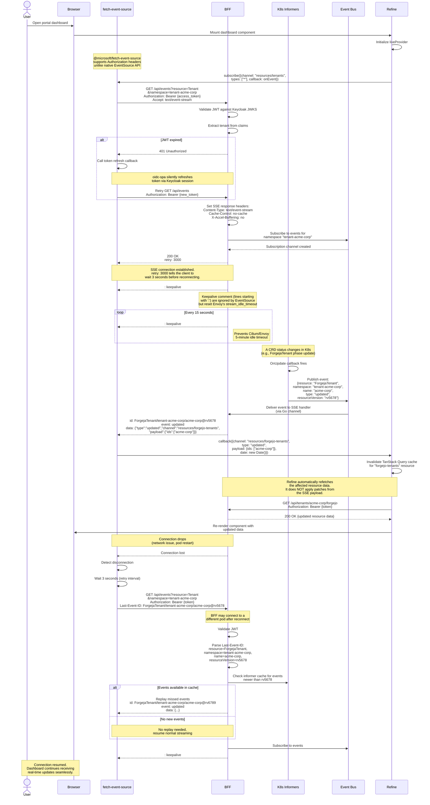
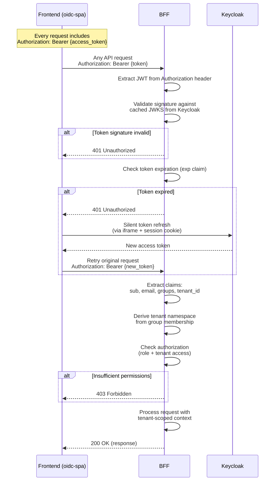

# Customer Portal Sequence Diagrams

**Date:** 2026-02-14
**Status:** Draft
**Author:** PM/Scrum Master Agent
**Repo:** TedaTech/platform-v1-portal

---

## Architecture Overview

These diagrams document the core interaction flows for the TedaTech Customer Portal. The system consists of:

- **Frontend:** React SPA (Vite + TanStack Router + Refine + shadcn/ui + oidc-spa)
- **BFF:** Go monolith with REST API (OpenAPI via `oapi-codegen`) + SSE for real-time
- **Auth:** Keycloak OIDC (realm: `cozy`, client: `portal-spa`)
- **K8s Backend:** `client-go` informers watching CRDs across tenant namespaces
- **Billing:** KillBill REST API (per-tenant API key from K8s Secret)
- **Real-time:** SSE from BFF to frontend (informer events -> in-process event bus -> SSE writer)
- **Ingress:** Cilium Gateway API (HTTPS termination, HTTP/2 to browsers)

Key CRDs:
- `ForgejaTenant` (platform.tedatech.app/v1alpha1) -- Forgejo org + GitOps repo via Crossplane
- Cozystack `Tenant` (apps.cozystack.io/v1alpha1) -- tenant namespace + resource quotas
- EDP Keycloak CRDs -- realm users, groups, clients

---

## 1. Customer Registration Flow

This flow covers the complete journey from a new user arriving at the portal URL through to a fully initialized portal session. Registration is handled by Keycloak's built-in registration form; the BFF is responsible for post-registration initialization (creating the KillBill billing account and resolving tenant membership).



### Implementation Notes

**Token storage:** `oidc-spa` stores the access token in a JavaScript closure (memory), not in `localStorage` or `sessionStorage`. This prevents XSS attacks from exfiltrating tokens. The trade-off is that a full page refresh requires a silent re-authentication via Keycloak's session cookie (iframe-based).

**JWKS caching:** The BFF caches Keycloak's JWKS (JSON Web Key Set) in memory and refreshes it when encountering an unknown `kid` (key ID) in a JWT header. This handles key rotation without downtime.

**KillBill account creation:** The `externalKey` field links the KillBill account to the Keycloak user ID (`sub` claim). This is an idempotent operation -- if the account already exists, the BFF skips creation. The BFF uses a per-tenant API key/secret pair stored in a K8s Secret, injected via environment variable or volume mount.

**Tenant resolution:** User-to-tenant mapping is derived from Keycloak group membership. The user's JWT contains a `groups` claim (e.g., `["/tenants/acme-corp"]`). The BFF maps this to K8s namespaces labeled with the corresponding tenant group. A user may belong to multiple tenants.

**Error handling not shown:** Network timeouts, KillBill rate limiting (429 responses with `Retry-After`), and Keycloak unavailability are handled by the BFF with circuit breakers per upstream dependency. The frontend receives a structured error response and displays an appropriate message.

---

## 2. Tenant Provisioning Flow

This flow shows how an admin user creates a new tenant, which triggers the creation of multiple Kubernetes CRDs. Each CRD is reconciled by its respective operator (Cozystack, Crossplane, EDP). The BFF relays real-time status updates to the frontend via SSE, using the in-process event bus fed by K8s informers.



### Implementation Notes

**CRD creation order:** The Cozystack Tenant CR is created first because the namespace it provisions is required by namespaced resources. However, the ForgejaTenant and KeycloakRealmGroup CRDs are cluster-scoped or created in a shared namespace, so they can be created in parallel with the Tenant CR. The operators themselves are idempotent and will retry if dependencies are not yet ready.

**SSE event IDs:** Each SSE event ID follows the format `{CRDKind}/{name}@{resourceVersion}`. This enables `Last-Event-ID`-based resume on reconnection. If the client reconnects to a different BFF pod, that pod can check its informer cache for any events with a resourceVersion greater than the one in the `Last-Event-ID` header.

**Provisioning timeout:** The BFF should implement a provisioning timeout (e.g., 10 minutes). If any CRD does not reach `Ready=True` within the timeout, the BFF pushes an SSE event with `phase: "Failed"` and the frontend shows an error with the stuck CRD's status conditions.

**Rollback on partial failure:** If one CRD fails to provision (e.g., Forgejo API is down), the other CRDs may still succeed. The BFF does not automatically roll back successful CRDs. Instead, it reports the partial failure via SSE, and the admin can retry or manually intervene. Full rollback (deleting all CRDs) can be implemented as a separate admin action.

**Informer efficiency:** The BFF does not create new informers per SSE connection. A single set of informers watches all CRDs across all tenant namespaces. The in-process event bus routes events to the correct SSE connections based on resource type, namespace, and name filters specified in the SSE URL parameters.

---

## 3. Pipeline Trigger Flow (PR Creation)

This flow shows how a user deploys an application using a template, which triggers a pipeline that creates a pull request in the tenant's Forgejo GitOps repository. The Pipeline CRD is a custom resource reconciled by a pipeline operator running in the cluster.



### Implementation Notes

**Template storage:** Application templates are stored as ConfigMaps in the tenant namespace, labeled with `template.teda.tech/type=application`. Each ConfigMap contains a `schema.json` (parameter schema for validation) and template files (Kubernetes manifests with Go template placeholders). The BFF validates user-provided parameters against the schema before creating the Pipeline CR.

**Pipeline operator credentials:** The pipeline operator uses a Forgejo API token stored in a K8s Secret. Each tenant has its own Forgejo organization and API token, scoped to that organization. The operator reads the token from the Secret in the tenant namespace.

**Idempotency:** If the user accidentally triggers the same pipeline twice, the operator should detect duplicate branch names or open PRs and update the Pipeline CR status with an appropriate message rather than creating duplicate PRs.

**Pipeline cleanup:** Pipeline CRs are retained for audit purposes but can be garbage-collected after a configurable TTL (e.g., 30 days). The operator sets an `ownerReference` to the tenant, so deleting a tenant cascades to its pipelines.

**Post-merge flow (not shown):** After the user merges the PR in Forgejo, Flux detects the change on the `main` branch and applies the new manifests to the tenant namespace. The application deployment is managed entirely by GitOps from this point forward. The portal can show deployment status by watching the relevant Deployment/StatefulSet CRDs via the same SSE mechanism.

---

## 4. Billing Subscription Change Flow

This flow covers the complete cycle of a tenant admin changing their billing plan, including the asynchronous webhook from KillBill that triggers resource quota updates in Kubernetes.



### Implementation Notes

**KillBill authentication model:** KillBill uses per-tenant API key/secret pairs, not user-level authentication. The BFF retrieves these credentials from a K8s Secret in the tenant's namespace. This means the BFF acts as a trusted intermediary -- it authenticates the user via JWT, then uses service-level credentials to call KillBill.

**Plan-to-quota mapping:** The mapping from KillBill plan names to Kubernetes resource quotas is maintained as a ConfigMap in the BFF's namespace (e.g., `plan-quota-mapping`). This decouples billing plan definitions (in KillBill) from infrastructure resource allocations (in K8s). Example mapping:

| Plan         | CPU | Memory | Storage | Namespaces |
|--------------|-----|--------|---------|------------|
| starter      | 4   | 8Gi    | 50Gi    | 1          |
| professional | 8   | 16Gi   | 200Gi   | 3          |
| enterprise   | 32  | 64Gi   | 1Ti     | 10         |

**Webhook verification:** KillBill webhooks should be verified using a shared secret (HMAC signature) to prevent spoofing. The BFF validates the signature before processing the webhook payload. Replay protection can be implemented by checking the event ID against a short-lived deduplication cache.

**Effective date options:** The `effectiveDate` field supports three values:
- `IMMEDIATE` -- change takes effect now, current period is prorated
- `END_OF_TERM` -- change takes effect at the next billing cycle
- A specific ISO 8601 date

**Downgrade handling:** When downgrading, the BFF should check whether the tenant's current resource usage exceeds the new plan's quotas. If so, the BFF returns a 422 with a message explaining which resources need to be reduced before the downgrade can proceed. The actual quota reduction in K8s only happens after the webhook confirms the plan change.

---

## 5. Real-Time Dashboard Connection Flow

This flow details how the frontend establishes and maintains the SSE connection for real-time dashboard updates. It covers the full lifecycle: initial connection, keepalive handling, event processing, and automatic reconnection with `Last-Event-ID` resume.



### Implementation Notes

**Token refresh during SSE:** `@microsoft/fetch-event-source` supports an `onopen` callback and custom `fetch` implementation. The custom Refine `liveProvider` should intercept 401 responses, trigger `oidc-spa`'s silent token refresh, and retry the SSE connection with the new token. This is transparent to the user.

**Event bus implementation:** The in-process event bus is a simple pub/sub system using Go channels. Each SSE connection creates a buffered channel (e.g., capacity 64). The event bus maintains a map of `namespace -> []channel`. When an informer fires, the event is published to all channels subscribed to that namespace. If a channel's buffer is full (slow consumer), the event is dropped for that connection -- the client will catch up via the next REST fetch triggered by Refine's query invalidation.

**`Last-Event-ID` replay:** The BFF can replay missed events because each BFF pod maintains its own informer cache. The informer cache stores the current state of all watched objects with their resource versions. On reconnection, the BFF compares the `Last-Event-ID`'s resource version with the current resource version in the cache. If the resource has changed, it sends a synthetic "updated" event. This is not a full event log replay -- it only provides the current state delta. For the portal's use case (showing current status), this is sufficient.

**Keepalive interval:** The 15-second keepalive interval is chosen to be well under Cilium/Envoy's default 5-minute `stream_idle_timeout`. Even if the timeout is reduced via configuration, 15 seconds provides ample margin. The keepalive comment (`: keepalive\n\n`) adds negligible bandwidth (~15 bytes per message).

**Multiple SSE streams:** When a user navigates between pages, the frontend may open multiple SSE streams (one per resource type being watched). Over HTTP/2 (served by Cilium Gateway by default for HTTPS), these streams are multiplexed over a single TCP connection, eliminating the HTTP/1.1 six-connection-per-origin limit. The Refine `liveProvider` manages stream lifecycle -- streams are opened on component mount and closed on unmount.

**Graceful degradation:** If the SSE connection cannot be established (e.g., BFF is down), the dashboard still functions. Refine's `dataProvider` (REST CRUD) is independent of the `liveProvider` (SSE). The user sees data but without real-time updates. The `liveProvider` continues reconnection attempts in the background. When the BFF comes back online, real-time updates resume automatically.

---

## Appendix: Cross-Cutting Concerns

### Authentication Flow Summary

All API calls from the frontend to the BFF follow the same authentication pattern:



### Error Response Format

All BFF error responses follow a consistent JSON structure:

```json
{
  "error": {
    "code": "TENANT_NOT_FOUND",
    "message": "Tenant 'acme-corp' does not exist or you do not have access",
    "details": {
      "tenantId": "acme-corp",
      "requiredRole": "admin"
    }
  }
}
```

HTTP status codes used:
- `400` -- Malformed request (invalid JSON, missing required fields)
- `401` -- Invalid or expired JWT
- `403` -- Valid JWT but insufficient permissions
- `404` -- Resource not found (or tenant not accessible to user)
- `409` -- Conflict (e.g., tenant name already exists)
- `422` -- Validation error (e.g., invalid plan, quota exceeded)
- `429` -- Rate limited (propagated from KillBill or BFF-level rate limiting)
- `500` -- Internal server error (K8s API unreachable, unexpected failure)
- `502` -- Upstream dependency failed (KillBill down, Keycloak unreachable)
- `503` -- BFF not ready (informer caches not synced)

### SSE Event Format

All SSE events from the BFF follow the format defined in the [SSE specification](https://html.spec.whatwg.org/multipage/server-sent-events.html):

```
id: {CRDKind}/{namespace}/{name}@{resourceVersion}
event: {created|updated|deleted}
retry: 3000
data: {"type":"updated","channel":"resources/{resource}","payload":{"ids":["{name}"]},"phase":"{phase}","message":"{human-readable}"}

```

The `data` field contains a JSON object compatible with Refine's `LiveEvent` interface, extended with portal-specific fields (`phase`, `message`) for the provisioning UI.

---

## References

- [Architecture Analysis: BFF Monolith vs Microservices](architecture-analysis.md)
- [API Paradigm Comparison: REST vs GraphQL vs tRPC](api-paradigm-comparison.md)
- [Real-Time Protocol Comparison: WebSocket vs SSE](realtime-protocol-comparison.md)
- [Refine liveProvider Documentation](https://refine.dev/docs/realtime/live-provider/)
- [@microsoft/fetch-event-source](https://www.npmjs.com/package/@microsoft/fetch-event-source)
- [oidc-spa Documentation](https://github.com/keycloakify/oidc-spa)
- [KillBill API Documentation](https://docs.killbill.io/)
- [MDN: Server-Sent Events](https://developer.mozilla.org/en-US/docs/Web/API/Server-sent_events/Using_server-sent_events)
- [Keycloak OIDC Endpoints](https://www.keycloak.org/docs/latest/securing_apps/#endpoints)
